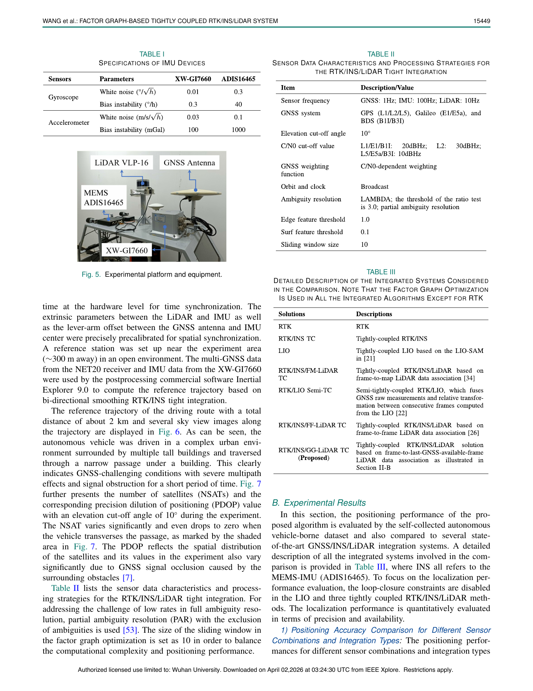
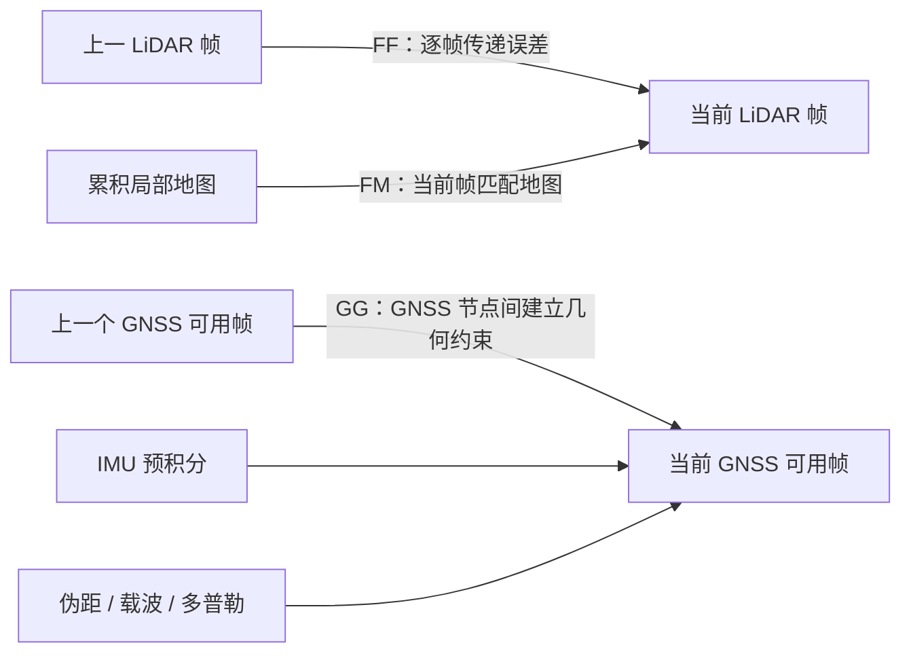
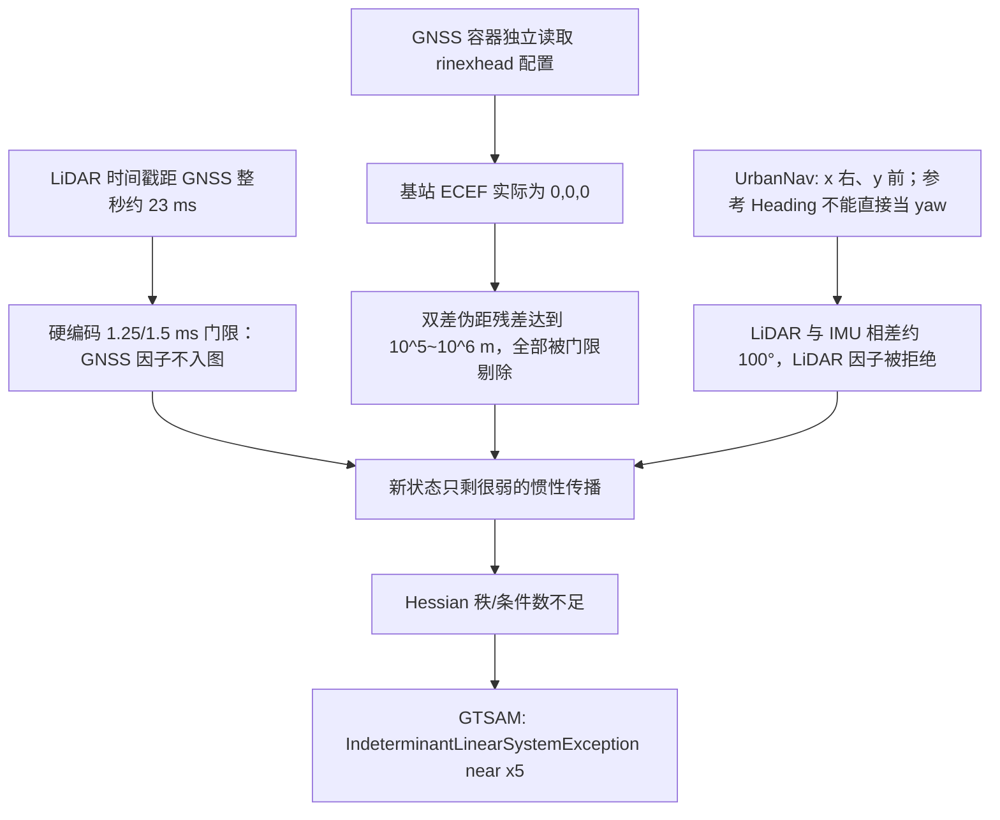
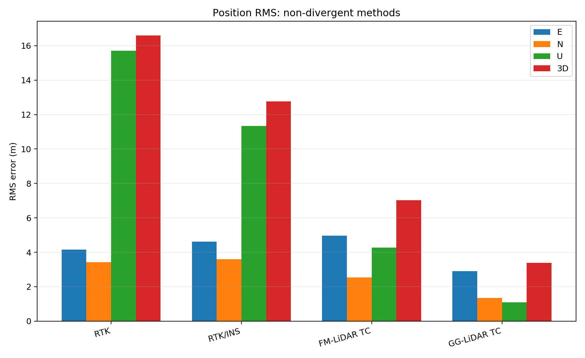
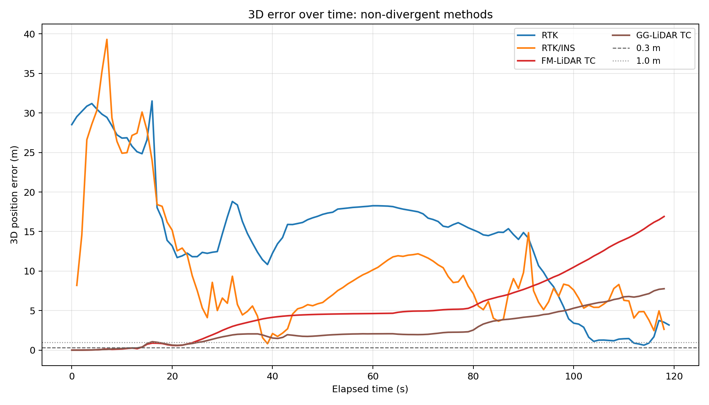
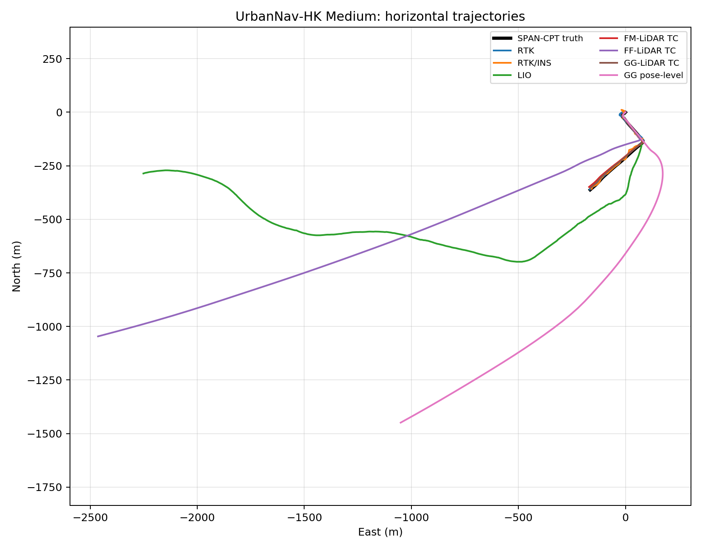
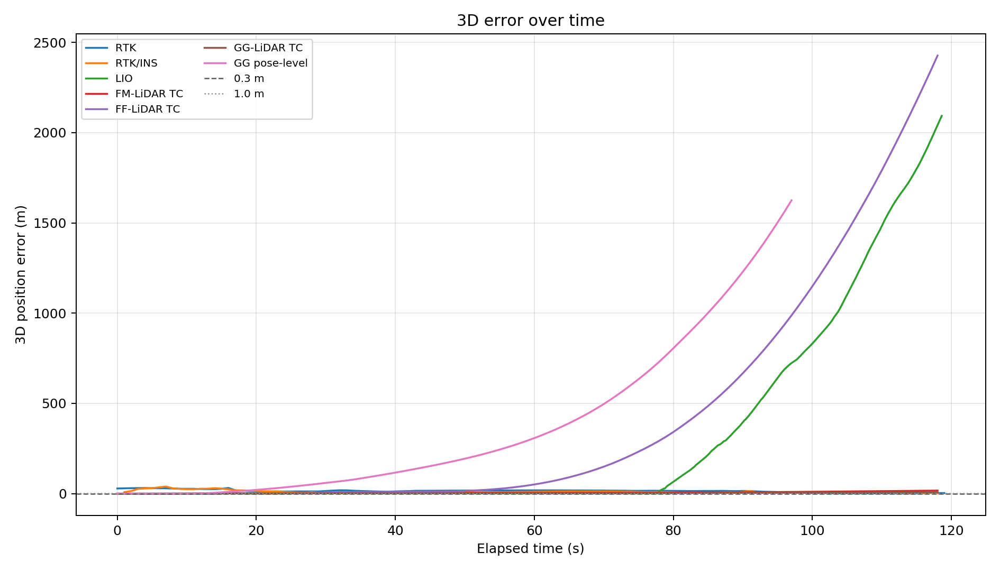

# GLINS 公共数据消融实验报告

> 数据集：UrbanNav-HK Medium-Urban-1 公共 120 s 子段
> 运行日期：2026-07-26
> 远程服务器：`zbwang@172.30.5.103:17253`
> 远程结果：`/data/zbwang/results/glins_public_ablation/urbannav_medium_120s_20260726_v1`

## 1. 先说结论

本次实验说明：**论文提出的 GG（frame-to-last-GNSS-available-frame）数据关联思想本身是有效的；此前的欠约束主要是代码与公共数据之间的时间、基站坐标和姿态坐标系没有正确对接，不是 GG 数学理论天然欠约束。**

修复数据接口与初始化后，GG 特征级紧耦合完整运行 120 s：

- 119 个 GNSS 融合历元；
- 0 次优化回滚；
- 0 次 LiDAR/IMU 一致性拒绝；
- 3D RMS 为 **3.386 m**，是本次所有不发散融合方法中最优；
- 相比 RTK、RTK/INS、FM，3D RMS 分别下降 **79.6%**、**73.5%**、**51.8%**。

但是本次结果没有复现论文中的 0.20 m。最重要的客观原因是：这个 120 s 公共段的 RTK 解中 **0 个 fixed、78 个 float、42 个 DGPS**，GNSS 本身并没有厘米级锚点。换句话说，GG 已经明显改善了弱 GNSS，但不能凭空制造不存在的 fixed 信息。

## 2. 实验对象与公平性

### 2.1 公共数据

使用服务器 `/data/zbwang/public/UrbanNav_HK_Medium_20210517` 下的数据：

| 数据 | 文件 | 规模 |
|---|---|---:|
| LiDAR + IMU bag | `medium_public_0_120_uncompressed.bag` | 120 s |
| IMU | `/imu/data` | 48,001 条，约 400 Hz |
| Velodyne HDL-32E | `/velodyne_points` | 1,198 帧，约 10 Hz |
| Rover RINEX | `UrbanNav-HK-Medium-Urban-1.ublox.f9p.obs` | 1 Hz GNSS |
| Base RINEX | `HKQT00HKG_R_20211370200_01H_01S_MO.rnx` | 香港 SatRef HKQT |
| 广播星历 | `BRDC00IGS_R_20211370000_01D_MN.rnx` | GPS 周 2158 |
| SPAN-CPT 真值 | `medium_public_0_120.reference_ecef.csv` | 120 历元 |

所有方法使用相同时间段、相同真值、相同外参、相同 IMU 噪声、相同 RTKLIB 配置，并关闭回环检测。消融过程中只改变 LiDAR 关联方式或是否使用某一类传感器约束。

### 2.2 论文消融与本次代码开关

论文第 IV 节的主要消融设计如下。



| 论文方法 | 含义 | 本次实现 |
|---|---|---|
| RTK | 单独 RTKLIB | `rtk.pos` |
| RTK/INS TC | GNSS 原始观测 + IMU | `run_public_gins.launch` |
| LIO | 纯 LiDAR/IMU，不使用 GNSS | `useGPS=false` |
| RTK/INS/FM-LiDAR TC | frame-to-map | `lidarAssociateMode=0` |
| RTK/INS/FF-LiDAR TC | frame-to-frame | `lidarAssociateMode=1` |
| RTK/INS/GG-LiDAR TC | frame-to-last-GNSS-frame | `lidarAssociateMode=2` |
| RTK/LIO Semi-TC | LIO 相对位姿 + GNSS | 当前代码不能严格隔离 |

本报告额外运行了 `GG pose-level`，即 `lidarAssociateMode=2, coupleMode=0`。它仍保留 IMU 图因子，只能作为“位姿级 LiDAR 约束”的补充对照，**不能标成论文严格意义的 Semi-TC**。

## 3. 三种 LiDAR 关联方式为什么会不同



因子图求解的核心可以写成：

\[
\min_{\mathcal X}
\sum_k \lVert r_{\text{IMU},k}\rVert^2_{\Sigma_{\text{IMU}}^{-1}}
+\sum_k \lVert r_{\text{GNSS},k}\rVert^2_{\Sigma_{\text{GNSS}}^{-1}}
+\sum_{(i,j)}\lVert r_{\text{LiDAR},ij}\rVert^2_{\Sigma_{\text{LiDAR}}^{-1}} .
\]

其中：

- IMU 因子连接相邻的位姿 \(X_k\)、速度 \(V_k\) 和零偏 \(B_k\)；
- GNSS 原始观测提供绝对位置与载波模糊度约束；
- LiDAR 点到平面因子可写成
  \[
  r_L=n^\top(Rp+t)+d ;
  \]
- FF 的 \(i,j\) 是相邻 LiDAR 帧，误差会一帧一帧累加；
- FM 把当前帧对齐到累积地图，地图中较早的错误对应可能反复影响后续；
- GG 只在 GNSS 可用帧之间建立 LiDAR 几何关系，让每段相对漂移在下一个绝对历元附近重新锚定。

因此 GG 的理论优势不是“增加了更多因子”，而是**选择了更不容易传播历史错误的关联端点**。

## 4. 此前为什么会欠约束

欠约束并不是一个单点故障，而是三个数据接口问题串联后的结果：



### 4.1 GNSS–LiDAR 时间门限过窄

公共 bag 的 LiDAR 关键帧约在 GNSS 历元后 18–25 ms。原代码分别使用约 1.25 ms、1.5 ms 和 15 ms 的多个硬编码门限，导致地图模块、IMU 预积分模块和输出模块对“同一个 GNSS 历元是否可用”判断不一致。

修复后统一使用可配置的 `gnssSyncTolerance=0.05 s`，并安全处理空队列和过期观测。

### 4.2 基站坐标没有进入原始观测因子

RTK 解码器能够从 RINEX 头读取 HKQT 坐标，但因子图中的 `gnssContainer` 会独立加载 RTKLIB 配置；使用 `ant2-postype=rinexhead` 时，它的 `prcopt.rb` 仍是零。

双差伪距残差为：

\[
r_{P,ij}^{DD}
=\big[(P_i^r-P_i^b)-(P_j^r-P_j^b)\big]
-\big[(\rho_i^r-\rho_i^b)-(\rho_j^r-\rho_j^b)\big].
\]

如果基站位置 \(b\) 被错误设为地心 `(0,0,0)`，几何距离项自然会产生百万米级错误。修复后显式写入 HKQT RINEX 头坐标：

```text
X = -2421567.8916 m
Y =  5384910.5631 m
Z =  2404264.3943 m
```

短段测试中伪距残差由 \(10^5\sim10^6\) m 降到几十米量级，GNSS 状态开始连续推进，欠约束回滚消失。

### 4.3 UrbanNav 姿态坐标轴映射错误

UrbanNav 标定文件明确说明车体轴为 `x=right, y=forward, z=up`，而优化器 RPY 是绕 `x/y/z` 轴表达。因此 SPAN-CPT 的车辆 `Roll/Pitch/Heading` 需要映射：

```text
optimizer roll  = reference Pitch
optimizer pitch = reference Roll
optimizer yaw   = -reference Heading
```

修复后的初始优化角为 `(0.44°, -1.74°, 132.53°)`，与 bag 内 Xsens 的 `(0.69°, -1.55°, 129.14°)` 接近。修复前直接填 `(-1.74°, 0.44°, -132.53°)`，会造成约 100° 的 LiDAR/IMU 冲突。

## 5. 本次实测结果

### 5.1 定量结果

| 方法 | 匹配历元 | E RMS (m) | N RMS (m) | U RMS (m) | 3D RMS (m) | 3D 中位数 (m) | P95 (m) | 最大值 (m) | <0.3 m | <1 m |
|---|---:|---:|---:|---:|---:|---:|---:|---:|---:|---:|
| RTK | 120 | 4.151 | 3.419 | 15.702 | 16.598 | 15.418 | 29.540 | 31.509 | 0.0% | 3.3% |
| RTK/INS | 118 | 4.615 | 3.591 | 11.336 | 12.755 | 7.810 | 27.894 | 39.298 | 0.0% | 0.8% |
| LIO | 1186 | 589.536 | 168.667 | 64.215 | 616.543 | 1.513 | 1661.249 | 2092.471 | 10.4% | 12.9% |
| FM-LiDAR TC | 119 | 4.956 | 2.541 | 4.274 | 7.020 | 4.625 | 14.611 | 16.907 | 11.8% | 21.0% |
| FF-LiDAR TC | 119 | 730.839 | 236.182 | 106.118 | 775.351 | 44.782 | 1949.333 | 2426.920 | 7.6% | 10.9% |
| **GG-LiDAR TC** | **119** | **2.911** | **1.337** | **1.096** | **3.386** | **2.036** | **6.791** | **7.771** | **11.8%** | **21.0%** |
| GG pose-level | 98 | 290.342 | 490.550 | 81.508 | 575.831 | 180.346 | 1340.475 | 1624.627 | 9.2% | 11.2% |

完整精度表同时保存在 [metrics.csv](metrics.csv) 和 [metrics.json](metrics.json)。

### 5.2 稳定方法局部对比



GG 在三个方向都更均衡，尤其将 RTK 的垂向 RMS 从 15.70 m 降到 1.10 m。FM 的水平北向误差较小，但东向和垂向仍明显大于 GG。



时序图显示：

- RTK 前 20 s 的 3D 误差约 25–32 m，主要来自 float/DGPS 垂向误差；
- RTK/INS 能平滑部分 GNSS 波动，但没有 LiDAR 几何时仍存在明显漂移；
- FM 在约 20 s 后逐渐积累到 17 m；
- GG 大部分时间保持在 1–5 m，末段上升但最大值仍只有 7.77 m。

### 5.3 全局轨迹与发散





纯 LIO、FF 和位姿级 GG 在后半段发散到千米量级，所以单看全局图时，稳定方法会挤在真值附近。它们的低中位数与高 RMS 同时出现，表示“前段可用、后段突然失稳”，不是评估脚本错误。

### 5.4 数值稳定性诊断

| 方法 | 耗时 (s) | 优化回滚 | LiDAR/IMU 拒绝 | 解读 |
|---|---:|---:|---:|---|
| RTK/INS | 11 | 0 | — | 正常完成，但缺少 LiDAR 几何 |
| LIO | 332 | 0 | 101 | 后段漂移后大量拒绝 |
| FM | 216 | 0 | 0 | 数值稳定，地图误差逐渐积累 |
| FF | 342 | 0 | 70 | 相邻帧误差链式传播 |
| **GG feature-level** | **327** | **0** | **0** | 全段稳定 |
| GG pose-level | 330 | 215 | 101 | 丢失逐特征几何后明显失稳 |

GG 特征级与 GG 位姿级使用相同关联端点，但表现差异巨大，说明本项目中“紧耦合到点/面特征”不是可有可无的实现细节，而是稳定性的关键来源。

## 6. 与论文结果怎么比较

论文 Table IV 的 3D RMS 为：

| 方法 | 论文 3D RMS (m) | 本次 3D RMS (m) |
|---|---:|---:|
| RTK | 12.40 | 16.60 |
| RTK/INS | 9.34 | 12.76 |
| LIO | 18.89 | 616.54（后段发散） |
| FM | 14.43 | 7.02 |
| FF | 0.75 | 775.35（后段发散） |
| GG | **0.20** | **3.39** |

这两列不能当作同数据集复现误差，因为论文使用自采平台和完整实验路线，本次使用 UrbanNav 公共子段。但相对趋势中，GG 仍是稳定融合方法中最优。

本次没有达到论文分米级，主要有四点：

1. 本段 RTK 没有 fixed 解，绝对锚点精度先天不足；
2. HKQT 到车辆约为公里级基线，且车辆处于香港城市峡谷；
3. 当前工程仍保留针对作者自有 IMU 的硬编码初始零偏，尚未完全数据集化；
4. 公开 bag、RINEX 与 SPAN-CPT 的硬件时间链并非论文自采系统的统一触发链。

因此，当前结果支持“GG 理论有效”，但不能宣称“已经精确复现论文数值”。

## 7. 已完成的代码修复

主要修改如下：

- `gnssContainer.h`
  - GNSS 队列判空与互斥保护；
  - 可配置同步容差；
  - 只丢弃明确过期的观测。
- `utility.h`
  - 新增 `gnssSyncTolerance` 参数。
- `imuPreintegration.cpp`
  - GNSS 同步、可用性判断和结果写出统一使用同一关联结果；
  - 避免公共数据有效 GNSS 历元被 5 ms 写出门限静默丢弃。
- `mapOptmizationGps.cpp`
  - 地图端 GNSS–LiDAR 关联使用统一容差；
  - 离线模拟时钟结束时不再阻塞可视化线程。
- `test_lio.cpp`
  - 纯 LIO 模式不再解码/注入 GNSS；
  - `backward.hpp` 改为可选依赖；
  - 离线运行可关闭地图可视化线程。
- `test_gins.cpp`
  - IMU–GNSS 使用 5 ms 上限，避免 400 Hz IMU 提前 50 ms 消费 GNSS；
  - 支持完成后自动退出；
  - `backward.hpp` 改为可选依赖。
- 新增公共数据配置、启动与评估脚本：
  - `config/params_urbannav_medium_ablation.yaml`
  - `config/conf/Urban_medium_public.conf`
  - `launch/run_public_ablation.launch`
  - `launch/run_public_gins.launch`
  - `scripts/run_public_ablation.sh`
  - `scripts/evaluate_public_ablation.py`

## 8. 如何复现

连接服务器：

```bash
ssh -p 17253 zbwang@172.30.5.103
```

进入工程并加载环境：

```bash
cd /home/zbwang/GLINS
overlay=/home/zbwang/FAST_GLIO/.remote_deps/root/opt/ros/noetic
export LD_LIBRARY_PATH="$overlay/lib:/home/zbwang/GLINS/.deps/gtsam-install/lib${LD_LIBRARY_PATH:+:$LD_LIBRARY_PATH}"
source /opt/ros/noetic/setup.bash
source /home/zbwang/GLINS/devel/setup.bash
```

重新运行完整消融：

```bash
/home/zbwang/GLINS/src/glins/scripts/run_public_ablation.sh \
  /data/zbwang/results/glins_public_ablation/urbannav_medium_120s_recheck
```

重新评估：

```bash
python3 /home/zbwang/GLINS/src/glins/scripts/evaluate_public_ablation.py \
  /data/zbwang/results/glins_public_ablation/urbannav_medium_120s_recheck
```

## 9. 下一步优化建议

优先级从高到低：

1. **把初始 IMU 零偏参数化。** 当前 `IMUPreintegration` 中仍有作者私有设备的硬编码零偏，应改成 YAML 参数或静止段在线估计。
2. **加入 GNSS 质量自适应噪声。** 根据 RTK fixed/float/DGPS、卫星高度角、残差和 ratio 动态调节原始观测权重，避免 float 解被当作厘米级锚点。
3. **把所有时间关联收敛到一个“最近邻且不跨历元”的同步器。** 目前已统一主路径容差，但更好的做法是显式保存配对时间差并写入日志。
4. **为 LiDAR 拒绝增加降级策略。** 连续拒绝时不应只依赖惯性传播，可临时使用更弱的鲁棒位姿因子或触发局部重定位。
5. **实现严格 Semi-TC 开关。** 需要允许关闭图中的 IMU 因子，只保留 LIO 相对位姿与 GNSS，才能完全复现论文的 Semi-TC 组。
6. **在更多公共路线复测。** 至少加入 UrbanNav Harsh/Mongkok，并优先选择具有真实同步 base RINEX 和完整真值的区段。

## 10. 最终判断

- **理论是否有问题？** 暂无证据表明 GG 因子图理论导致欠约束；公共数据上的相对结果反而支持其设计动机。
- **代码是否有问题？** 有，而且此前是主要原因：时间门限、基站坐标、姿态轴映射三项会共同移除 GNSS 与 LiDAR 有效约束。
- **优化后是否解决？** 欠约束与全段回滚在 GG 特征级组中已经解决，120 s 全程 0 回滚、0 LiDAR 拒绝；精度从 RTK 的 16.60 m 提升到 3.39 m。
- **是否达到论文精度？** 没有。当前主要限制已从“图不连通/代码崩溃”转变为“公共数据 GNSS 质量与剩余数据集适配”。
